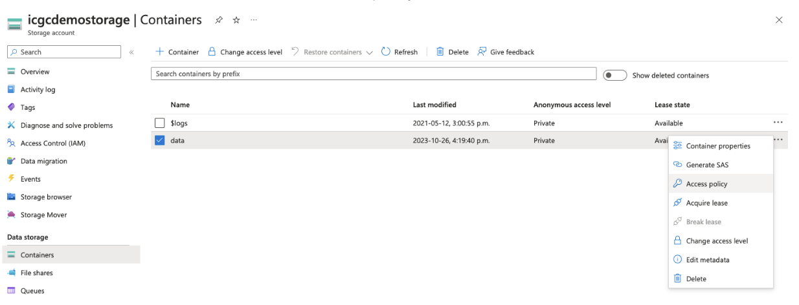
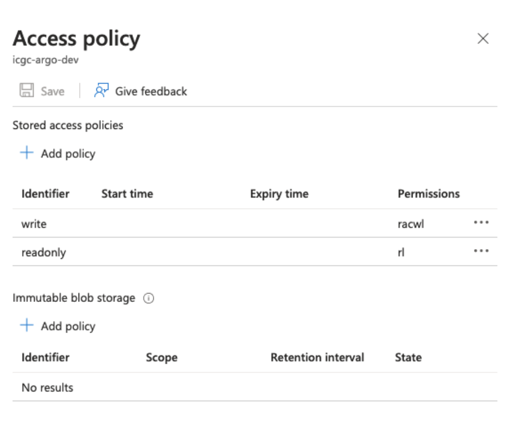

# Object Storage Setup

To set up your object storage for Score:

1. **Register with an object storage provider** of your choice and follow their instructions for setting up and configuring their service.

    :::info Minio Local Quickstart
    If you'd like to quickly spin up a compatible object storage locally, you can run the following command: `docker run --name minIO -p 9000:9000 -e MINIO_ACCESS_KEY=minio -e MINIO_SECRET_KEY=minio123 minio/minio:RELEASE.2018-05-11T00-29-24Z server /data`
    :::

2. **Create two data buckets for Score** to use:

- A bucket to store object data
- A bucket to store and maintain state information

    :::tip 
    After creation, remember the IDs of both buckets, as they will be required later for configuring Score.
    :::

3. You may need to **create a `/data` sub-folder** in advance for each bucket. This requirement depends on your storage provider and is summarized below:

    | Storage Provider | Data sub-folder required |
    |--|--|
    | Amazon S3 | No |
    | Microsoft Azure | No |
    | MinIO | No |
    | OpenStack with Ceph | Yes |

4. **Record the URL, access key, and secret key** used to access your storage service. These credentials will be required later for configuring Score. Record and securely store these values.

    :::info For Amazon S3 buckets
    Remember to document the geographical region where you have configured your buckets to be stored, as this will be required when configuring Score.
    :::

## Environment Variable Setup

Once your object storage is established, the next step involves configuring Score for connection. The specific configuration settings will vary based on your object storage provider. Below are the detailed setup instructions.

### AWS, Ceph, or Minio

To connect Score with AWS, Ceph, or Minio storage, modify your `.env.score` file as follows:

```bash
# ============================
# Object Storage Configuration Variables
# ============================

SPRING_PROFILES_ACTIVE=prod,aws

S3_ENDPOINT=http://localhost:9000
S3_ACCESS_KEY=minio
S3_SECRETKEY=minio123
S3_SIGV4ENABLED=true

BUCKET_NAME_OBJECT=object.bucket
BUCKET_NAME_STATE=state.bucket
BUCKET_SIZE_POOL=0
BUCKET_SIZE_KEY=2

UPLOAD_PARTSIZE=1048576
UPLOAD_RETRY_LIMIT=10
UPLOAD_CONNECTION_TIMEOUT=60000
UPLOAD_CLEAN_CRON="0 0 0 * * ?"
UPLOAD_CLEAN_ENABLED=true
```

<details>
<summary>**Click here for a summary of these variables**</summary>

**Storage Connection Settings**
* `S3_ENDPOINT`: API endpoint URL of your storage service. Score will communicate with the service via this URL
* `S3_ACCESSKEY`: Access key for your object storage buckets
* `S3_SECRETKEY`: Secret key for your object storage buckets
* `S3_SIGV4ENABLED`: Whether to use AWS S3 Signature Version 4 for authentication (true/false)

**Bucket Configuration**
* `BUCKET_NAME_OBJECT`: ID of the bucket for storing object data
* `BUCKET_NAME_STATE`: ID of the bucket for storing state information
* `BUCKET_SIZE_POOL`: Used for bucket size pooling
* `BUCKET_SIZE_KEY`: Used for bucket size key configuration

**Upload Settings**
* `UPLOAD_PARTSIZE`: Byte size of each upload chunk to the object storage (adjust for performance)
* `UPLOAD_RETRY_LIMIT`: Number of retry attempts for failed uploads before aborting
* `UPLOAD_CONNECTION_TIMEOUT`: Timeout duration in milliseconds for idle connections

**Optional Cleanup Configuration**
* `UPLOAD_CLEAN_CRON`: Schedule for the cleanup cron job (optional)
* `UPLOAD_CLEAN_ENABLED`: Whether to enable the cleanup cron job (optional, true/false)

</details>

### Azure

For connecting Score with Azure storage, update `.env.score` as follows:

```bash
SPRING_PROFILES_ACTIVE=prod,azure

AZURE_ENDPOINT_PROTOCOL=https
AZURE_ACCOUNT_NAME={storage_account_name}
AZURE_ACCOUNT_KEY={storage_account_secret_key}

BUCKET_NAME_OBJECT={object_bucket} # Object data storage bucket/container name
BUCKET_POLICY_UPLOAD={write_policy} # Access policy name for write operations
BUCKET_POLICY_DOWNLOAD={read_policy} # Access policy name for read operations

UPLOAD_PARTSIZE=104587
DOWNLOAD_PARTSIZE=250000000 # Default part size for downloads

OBJECT_SENTINEL=heliograph # Required sample object/file name for `ping` operations
```

<details>
<summary>**Click here for a summary of these variables**</summary>

**Azure Connection Settings**
* `AZURE_ENDPOINT_PROTOCOL`: Communication protocol for the Azure storage API endpoint (e.g., https)
* `AZURE_ACCOUNT_NAME`: Account name for accessing Azure object storage
* `AZURE_ACCOUNT_KEY`: Account key for accessing Azure object storage

**Bucket Configuration**
* `BUCKET_NAME_OBJECT`: Bucket ID for storing object data
* `BUCKET_POLICY_UPLOAD`: Access policy name for write operations
* `BUCKET_POLICY_DOWNLOAD`: Access policy name for read operations

**Performance Settings**
* `UPLOAD_PARTSIZE`: Byte size of each upload chunk (adjust for performance)
* `DOWNLOAD_PARTSIZE`: Byte size of each download chunk (adjust for performance)

**Monitoring Configuration**
* `OBJECT_SENTINEL`: Default sample object/file name for 'ping' operations

</details>

#### Access Policy Configuration for Azure

For Azure storage, you must define a storage access policy for your container.

1. **Access the Azure dashboard:** Select containers from the left-hand menu.
2. **Locate your container:** Choose `Access Policy` from the dropdown menu.

   

3. **Create `write` and `readonly` access policies:**

   

    :::info Azure storage access policies
    For more information on Azure storage access policies, visit [the official Azure storage services documentation](https://learn.microsoft.com/en-us/rest/api/storageservices/define-stored-access-policy#create-or-modify-a-stored-access-policy).
    :::