# Configuring Keycloak

There are multiple methods of deploying Keycloak. Documentation on Keycloak deployment can be found on the [Official Keycloak website](https://www.keycloak.org/guides#getting-started).

:::info Docker Quickstart
With Docker installed and running on your system you can quickly spin up Keycloak by running:

```bash
docker run --name keycloak -d \
  -p 8080:8080 \
  -e KEYCLOAK_ADMIN=admin \
  -e KEYCLOAK_ADMIN_PASSWORD=admin \
  quay.io/keycloak/keycloak:22.0 start-dev
```
If you need to install Docker, visit the [official Docker installation guide](https://docs.docker.com/get-docker/).

This command starts Keycloak on local port `8080` and creates an initial admin user with the username `admin` and password `admin`.

:::

:::warning Development Configuration
This setup is designated for development and testing purposes and should not be used in production settings. For production deployments, please refer to [Configuring Keycloak for Production](https://www.keycloak.org/server/configuration-production).
:::

## Overture API Key Provider

The Overture API Key provider extends Keycloak's functionality by adding custom logic that allows Keycloak to interact with Score. The following steps outline how to download and install the Overture API Key provider:

1. **Download the [Overture API Key Provider](https://github.com/oicr-softeng/keycloak-apikeys/releases/download/1.0.1/keycloak-apikeys-1.0.1.jar)**.
2. **Move the** `keycloak-apikeys.jar` file to the provider's folder within Keycloak (`opt/keycloak/providers/`).
3. **Restart the Keycloak server** for the updated provider to take effect.

## Realm Configuration

### Login to the Admin Console

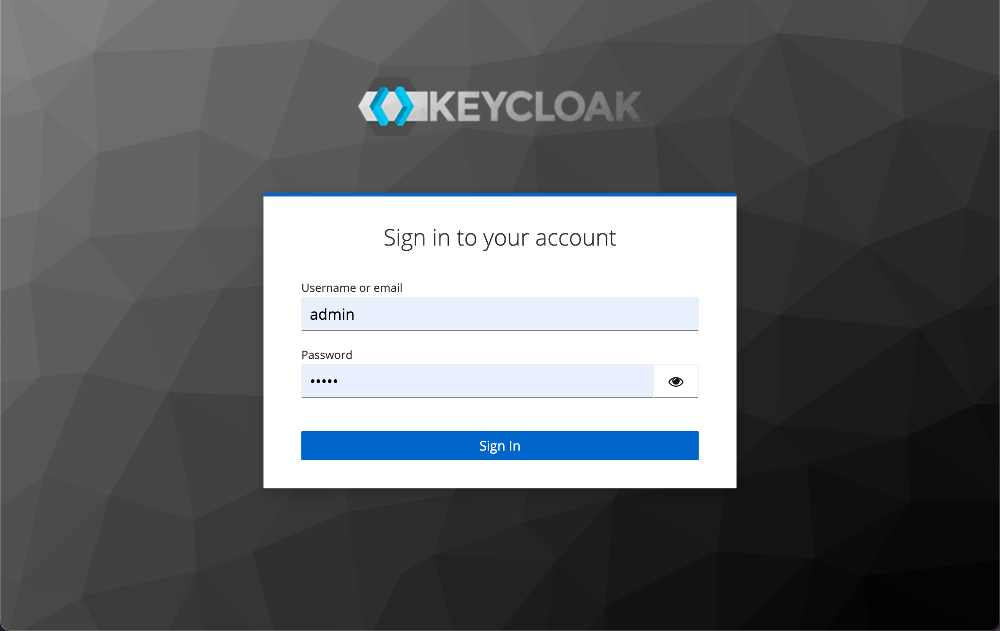

To access the admin console, navigate to `<url>/admin` (e.g., `localhost:8080/admin`) and log in with the credentials created during your Keycloak deployment.

### Create a Realm

Keycloak supports the creation of realms for managing isolated groups of applications and users. The default realm is named "master" and is intended solely for Keycloak management.

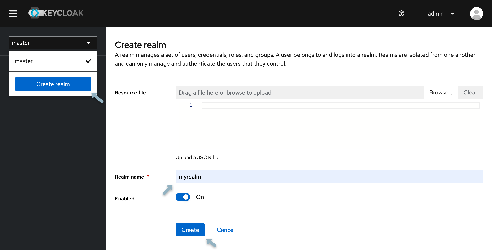

1. Open the **Keycloak Admin Console**.
2. In the top-left corner, **select "master"**, then choose **"Create Realm"**.
3. **Type** `myrealm` in the Realm Name field and select **"Create"**.

### Creating a Group

As an example, let's create a `data submitters` group. Afterwards, we will configure and apply the appropriate permissions for this group.

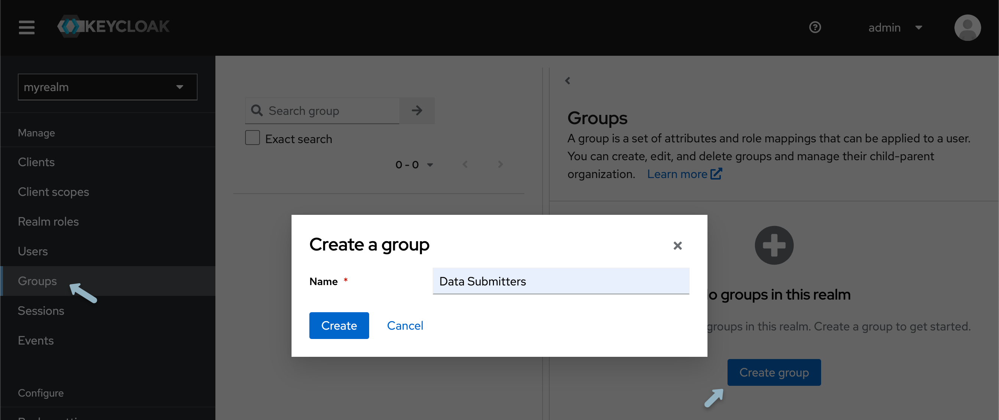

1. From the left-hand panel, select **"Groups"** and click **"Create group"**.
2. **Name the group** `data submitters` and select **"Create"**.

### Creating a User

To populate the realm with its first user:

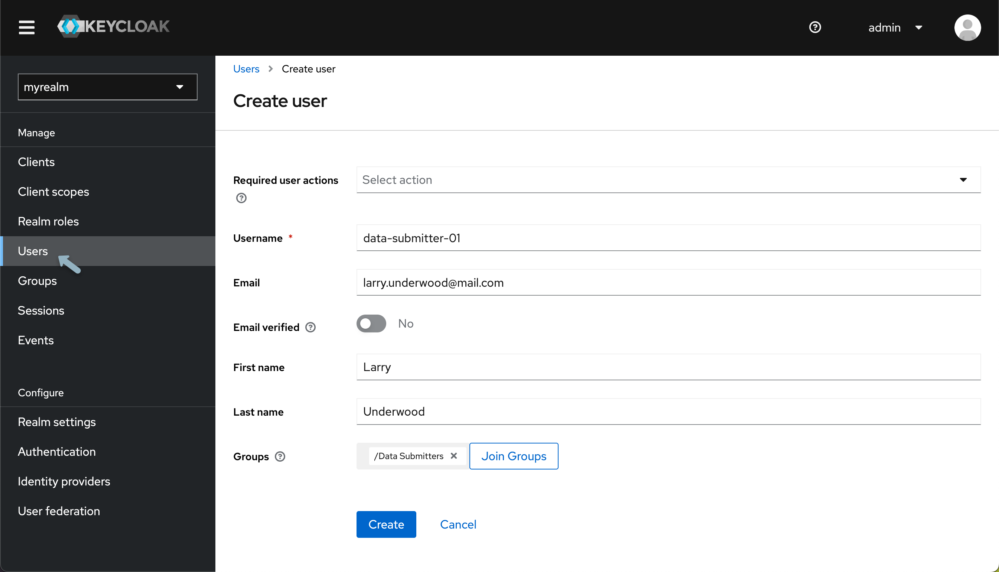

1. From the **Keycloak Admin Console**, under your newly created realm, select **"Users"** from the left-hand menu and click **"Add User"**.
2. **Input your details**, and then click **"Create"**.

   :::info Keycloak User Administration
   Various configurations can be applied to new users. Detailed information can be found within [Keycloak's official Server Administration documentation](https://www.keycloak.org/docs/latest/server_admin/).
   :::

Next, a password must be established:

1. At the top of the **User details page**, select the **"Credentials" tab**.
2. **Input your Password**. To avoid mandatory password updates upon first login, **set "Temporary" to "Off"**.
3. Using the newly created username and password, **log in to the Keycloak Account Console** accessed at `http://localhost:8080/realms/myrealm/account/`.

   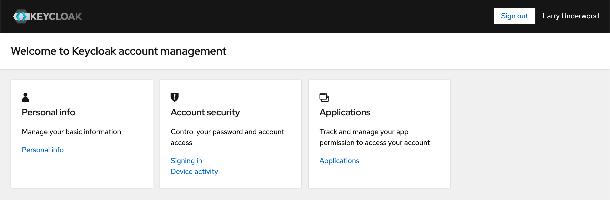

From the Account Console, users can manage their accounts, modify profiles, activate two-factor authentication, and link identity provider accounts.

## Application Setup

Before setting up and applying permissions, we must create a "client" for the Score API.

1. Re-open your Keycloak admin console at `<url>/admin` and confirm you are within your recently created realm.
2. Select **"Clients"** and then **"Create client"** and input the following:

   | Field           | Value          |
   | --------------- | -------------- |
   | **Client Type** | OpenID Connect |
   | **Client ID**   | score-api      |

3. Select **"Next"**, **enable Client Authentication**, confirm **Standard flow is enabled**, **enable authorization**, then click **"Next"** and **"Save"** (Nothing needs to be input for login settings).

   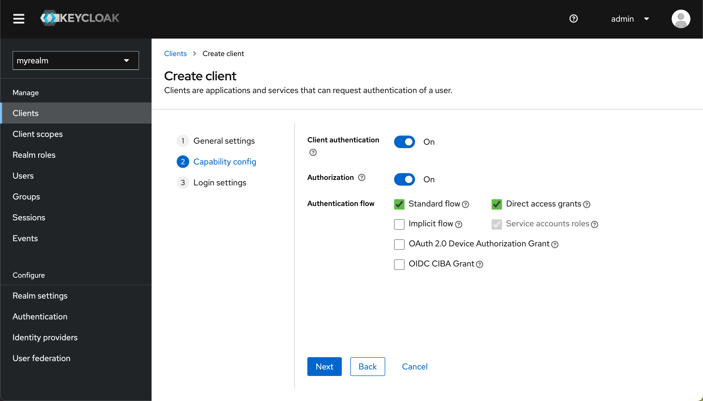

   :::info
   Make sure you have enabled both **"Client Authentication"** and **"Authorization"**.
   :::

### Configuring your Application

After creating our client, the next step is configuring the resource name, scopes, policies, and permissions. All these settings can be adjusted within the **Authorization tab** of the client you've just created. To access your client, select **"Clients"** from the left-hand navigation menu and from the **"Client list"** select the newly created client.

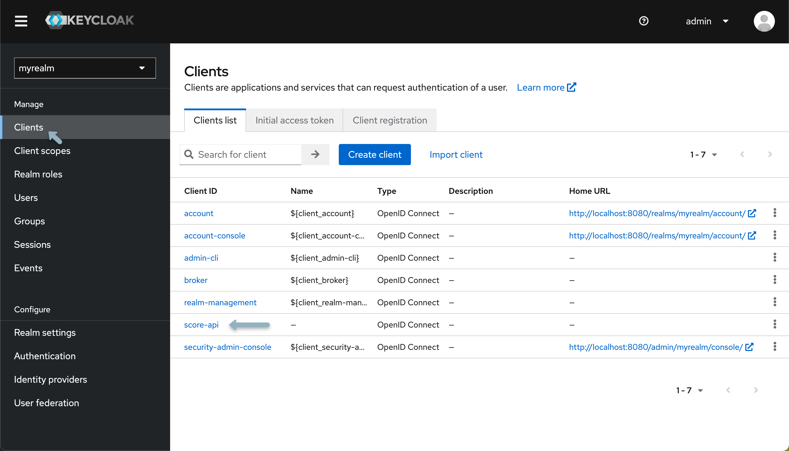

#### Scopes

Scopes represent actions that users can perform on a particular resource. They define the level of access a user has to a resource, such as reading, writing, updating, or deleting. For more details, check out the [Keycloak documentation](https://www.keycloak.org/docs/latest/authorization_services/index.html#scope).

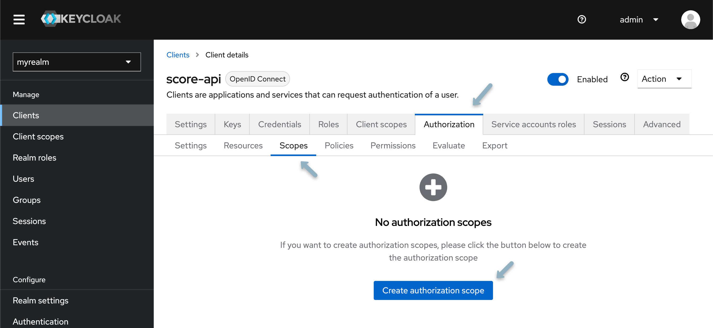

1. Navigate to the **Scopes tab** and select **"Create Authorization Scope"**.
2. **Create two authorization scopes**, one for **READ** and one for **WRITE** access.

#### Resources

Resources are objects or entities that users can interact with, such as a database, a file, or an API endpoint. When defining resources, you assign them to specific scopes, indicating what actions can be performed on those resources. For more details, check out the [Keycloak documentation](https://www.keycloak.org/docs/latest/authorization_services/index.html#resource).

1. From the **Resource tab**, select **"Create Resource"**.
2. Your first resource is generalized and will not be associated with any specific study or program. Name the resource `score`, and from the **authorization scopes field** dropdown select **"READ" and "WRITE"**.
3. **Click Save** and return to the client details page.

   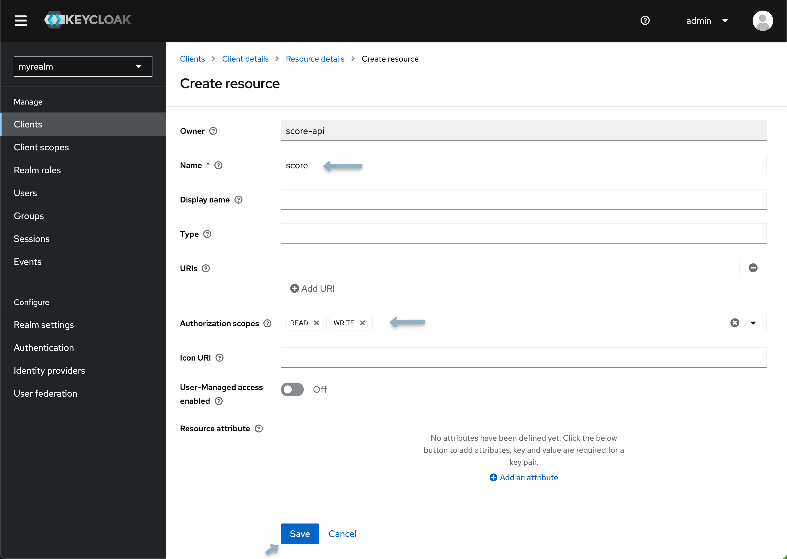

   :::info Introducing New Studies or Programs
   When introducing a new study or program, the creation of an additional resource within Keycloak is required. This includes re-applying the following policies, scopes, and permissions to desired users and groups.
   :::

#### Policies

Policies are rules that determine who can access resources based on certain conditions. They encapsulate the logic to decide whether to grant or deny access. Policies can be based on group membership, user attributes, or time-based conditions. For more details, check out the [Keycloak documentation](https://www.keycloak.org/docs/latest/authorization_services/index.html#policy).

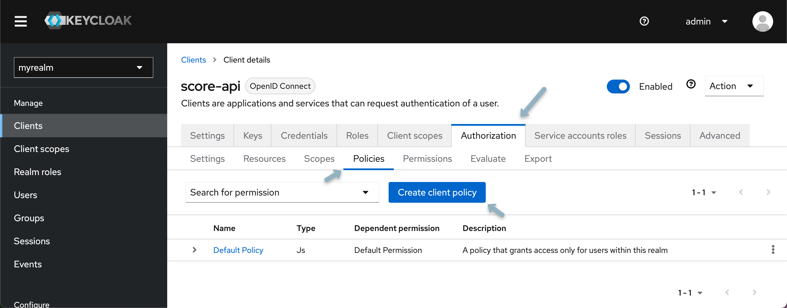

1. Select the **Policy tab** and click **"Create Client Policy"**.
2. From the popup modal, select **"group policy"**.
3. Name your policy (e.g., `data submission policy`) and select **"Add groups"**. Check the box next to the Data Submitters group and click **"Add"**, then **"Save"**.

#### Permissions

Permissions are the final decision-making mechanism connecting resources, scopes, and policies. They define which users or groups can access which resources under what circumstances. Permissions are evaluated based on the evaluation strategy chosen (e.g., Affirmative, Unanimous, or Consensus). For more details, check out the [Keycloak documentation](https://www.keycloak.org/docs/latest/authorization_services/index.html#permission).

1. Select the **Permissions tab**, click **"Create Permission"**, and from the dropdown select **"Create resource-based permission"**.
2. Assign the newly created resource, scope, and policy. Select `Affirmative strategy`.

## Creating a New Study

As mentioned previously, when introducing a new study or program, the creation of an additional resource within Keycloak is required. This includes re-applying policies and permissions to desired users and groups.

To add a new study, **create a new resource** with the desired name of your study or program (i.e., `score.study123`) and **repeat the steps outlined above**, specifically the Resources, Policies, and Permissions sections of configuring your application. Once complete, you should have the following:

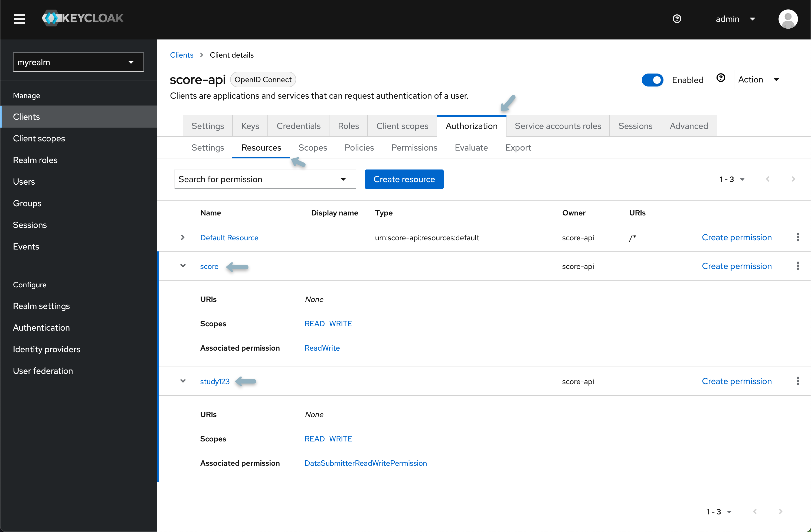

## Integration with Score

Update your `.env.score` file with the required Keycloak variables. The following code block will help you get started:

```bash
# ============================
# Keycloak Configurations
# ============================

# Profile configuration
SPRING_PROFILES_ACTIVE=aws,prod,secure

# Server and authentication settings
SERVER_PORT=8087
SERVER_SSL_ENABLED=false

# Logging
LOGGING_LEVEL_ORG_SPRINGFRAMEWORK_WEB=INFO
LOGGING_LEVEL_BIO_OVERTURE_SCORE_SERVER=INFO
LOGGING_LEVEL_ROOT=INFO

# Server Authentication integration
AUTH_SERVER_PROVIDER=keycloak
AUTH_SERVER_KEYCLOAK_HOST=http://localhost:8080
AUTH_SERVER_KEYCLOAK_REALM=myrealm
AUTH_SERVER_URL=http://localhost:8080/realms/{realmName}/apikey/check_api_key/
AUTH_SERVER_TOKENNAME=apiKey
AUTH_SERVER_CLIENTID=score-api
AUTH_SERVER_CLIENTSECRET=scoresecret
AUTH_SERVER_SCOPE_STUDY_PREFIX=score.
AUTH_SERVER_SCOPE_UPLOAD_SUFFIX=.WRITE
AUTH_SERVER_SCOPE_DOWNLOAD_SUFFIX=.READ
AUTH_SERVER_SCOPE_DOWNLOAD_SYSTEM=score.WRITE
AUTH_SERVER_SCOPE_DOWNLOAD_SUFFIX=.READ
AUTH_SERVER_SCOPE_UPLOAD_SYSTEM=score.READ
AUTH_SERVER_SCOPE_UPLOAD_SUFFIX=.WRITE
SPRING_SECURITY_OAUTH2_RESOURCESERVER_JWT_JWKSETURI=http://localhost:8080/realms/{realm-name}/protocol/openid-connect/certs
```

Replace any default values with the values specific to your environment. The variables are explained in detail below:

<details>
<summary>**Click here for details**</summary>

**Profile Configuration**
- `SPRING_PROFILES_ACTIVE`: Defines active Spring profiles for the application (aws,prod,secure)

**Server and Authentication Settings**
- `SERVER_PORT`: The port number on which the server will listen (default: 8087)
- `SERVER_SSL_ENABLED`: Indicates whether SSL is enabled for the server (default: false)

**Logging Configuration**
- `LOGGING_LEVEL_ORG_SPRINGFRAMEWORK_WEB`: Sets Spring Framework web components logging level (default: INFO)
- `LOGGING_LEVEL_BIO_OVERTURE_SCORE_SERVER`: Sets Score Server components logging level (default: INFO)
- `LOGGING_LEVEL_ROOT`: Sets the root logging level (default: INFO)

**Server Authentication Integration**
- `AUTH_SERVER_PROVIDER`: Specifies the authentication server provider (must be keycloak)
- `AUTH_SERVER_KEYCLOAK_HOST`: The host address for the Keycloak server (default: http://localhost:8080)
- `AUTH_SERVER_KEYCLOAK_REALM`: The realm in Keycloak where Score service is registered (example: myrealm)
- `AUTH_SERVER_URL`: Keycloak API endpoint for API key authentication
- `AUTH_SERVER_TOKENNAME`: Token identifier name (keep as default: apiKey)
- `AUTH_SERVER_CLIENTID`: Client ID for Score application in Keycloak (example: score-api)
- `AUTH_SERVER_CLIENTSECRET`: Client secret found under "Client details" → "Credentials tab"

**Scope Configuration**
- `AUTH_SERVER_SCOPE_STUDY_PREFIX`: Prefix for study-specific scopes (default: score.)
- `AUTH_SERVER_SCOPE_DOWNLOAD_SYSTEM`: System-level download scope (default: score.WRITE)
- `AUTH_SERVER_SCOPE_DOWNLOAD_SUFFIX`: Study-level download scope suffix (default: .READ)
- `AUTH_SERVER_SCOPE_UPLOAD_SYSTEM`: System-level upload scope (default: score.READ)
- `AUTH_SERVER_SCOPE_UPLOAD_SUFFIX`: Study-level upload scope suffix (default: .WRITE)

**JWT Configuration**
- `SPRING_SECURITY_OAUTH2_RESOURCESERVER_JWT_JWKSETURI`: URI for JWT JSON Web Key Set for OAuth2 resource server

</details>